# ERD Diagram - Mermaid Format

## ERD đầy đủ và chính xác (Mermaid ER Diagram)

```mermaid
erDiagram
    Users ||--o{ AuthTokens : "has many"
    Users ||--|| Profiles : "has one"
    Users ||--o{ Blocks : "blocker"
    Users ||--o{ Blocks : "blocked"
    Users ||--o{ Friends : "user_a"
    Users ||--o{ Friends : "user_b"
    Users ||--o{ Friend_requests : "from_user"
    Users ||--o{ Friend_requests : "to_user"
    Users ||--o{ Follows : "user_id"
    Users ||--o{ Follows : "target_user_id"
    Users ||--o{ Follow_requests : "from_user"
    Users ||--o{ Follow_requests : "to_user"
    Users ||--o{ Posts : "creates"
    Users ||--o{ Comments : "writes"
    Users ||--o{ Post_reactions : "reacts"
    Users ||--o{ Comment_reactions : "reacts"
    Users ||--o{ Comment_tags : "tagged_in"
    Users ||--o{ Saved_posts : "saves"
    Users ||--o{ Messages : "sends"
    Users ||--o{ Messages : "receives"
    Users ||--o{ Message_reactions : "reacts"
    Users ||--o{ Notifications : "receives"
    Users ||--o{ Notifications : "actor"
    
    Posts ||--o{ Post_media : "has"
    Posts ||--o{ Post_reactions : "has"
    Posts ||--o{ Comments : "has"
    Posts ||--o{ Saved_posts : "saved_by"
    
    Comments ||--o{ Comments : "parent_comment"
    Comments ||--o{ Comment_reactions : "has"
    Comments ||--o{ Comment_tags : "has"
    
    Messages ||--o{ Message_media : "has"
    Messages ||--o{ Message_reactions : "has"
    
    Users {
        UUID id PK
        string phone
        string email
        string password_hash
        string username
        boolean is_active
        timestamp created_at
        timestamp updated_at
    }
    
    AuthTokens {
        UUID id PK
        UUID user_id FK
        text token
        text device_info
        timestamp expires_at
        boolean revoked
        timestamp created_at
    }
    
    Profiles {
        UUID id PK
        UUID user_id FK "UNIQUE"
        string full_name
        text avatar_url
        text bio
        date birthday
        string gender
        string location
        json privacy_settings
        timestamp created_at
        timestamp updated_at
    }
    
    Blocks {
        UUID id PK
        UUID blocker FK
        UUID blocked FK
        timestamp created_at
    }
    
    Friends {
        UUID id PK
        UUID user_a FK
        UUID user_b FK
        timestamp since
    }
    
    Friend_requests {
        UUID id PK
        UUID from_user FK
        UUID to_user FK
        text message
        string status
        timestamp created_at
        timestamp updated_at
    }
    
    Follows {
        UUID id PK
        UUID user_id FK
        UUID target_user_id FK
        timestamp created_at
    }
    
    Follow_requests {
        UUID id PK
        UUID from_user FK
        UUID to_user FK
        string status
        timestamp created_at
        timestamp updated_at
    }
    
    Posts {
        UUID id PK
        UUID user_id FK
        text content
        string visibility
        string location
        timestamp created_at
        timestamp updated_at
        boolean is_deleted
    }
    
    Post_media {
        UUID id PK
        UUID post_id FK
        text media_url
        string media_type
        integer order_index
    }
    
    Post_reactions {
        UUID id PK
        UUID post_id FK
        UUID user_id FK
        string emoji
        timestamp created_at
    }
    
    Comments {
        UUID id PK
        UUID post_id FK
        UUID user_id FK
        UUID parent_comment_id FK
        text content
        text image_url
        timestamp created_at
        timestamp updated_at
        boolean is_deleted
    }
    
    Comment_reactions {
        UUID id PK
        UUID comment_id FK
        UUID user_id FK
        string emoji
        timestamp created_at
    }
    
    Comment_tags {
        UUID id PK
        UUID comment_id FK
        UUID tagged_user_id FK
        timestamp created_at
    }
    
    Saved_posts {
        UUID id PK
        UUID user_id FK
        UUID post_id FK
        timestamp created_at
    }
    
    Messages {
        UUID id PK
        UUID from_user FK
        UUID to_user FK
        text content
        boolean is_read
        timestamp created_at
        timestamp updated_at
    }
    
    Message_media {
        UUID id PK
        UUID message_id FK
        text media_url
        string media_type
    }
    
    Message_reactions {
        UUID id PK
        UUID message_id FK
        UUID user_id FK
        string emoji
        timestamp created_at
    }
    
    Notifications {
        UUID id PK
        UUID user_id FK
        UUID actor_id FK
        string type
        json payload
        boolean is_read
        timestamp created_at
    }
```

## Ghi chú về Relationships

### Cardinality:
- `||--o{` : One-to-Many (1:N)
- `||--||` : One-to-One (1:1)
- `}o--o{` : Many-to-Many (N:N) - qua junction table

### Các relationship đặc biệt:

1. **Blocks**: N:N với 2 vai trò (blocker và blocked)
2. **Friends**: N:N với 2 vai trò (user_a và user_b)
3. **Comments**: Self-referencing (parent_comment_id)
4. **Messages**: N:N với 2 vai trò (from_user và to_user)
5. **Notifications**: N:N với 2 vai trò (user_id và actor_id)

